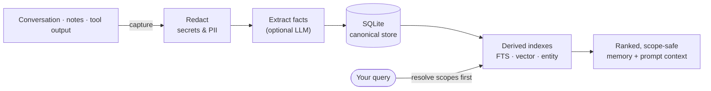

# 🧠 Naru Memory

[](https://www.npmjs.com/package/@narulabs/naru)
[](./LICENSE)
[](https://nodejs.org)
[](#status)

**A local-first memory layer for AI agents and developer workflows.** Naru captures durable facts from your work and feeds the right ones back — to your agent or your own tools — on demand. Everything lives in a single SQLite file on your machine: **private, inspectable, and portable**, with no hosted service required.

> Think of it as long-term memory your AI can read and write — that *you* own.

```bash
npm install -g @narulabs/naru
naru init
naru add "We use pnpm workspaces and Vitest" --scope project:my-app
naru search "test runner" --scope project:my-app
```

---

## The problem

AI agents start every session from zero. They forget your preferences, your project's conventions, and what you decided last week — so you keep re-explaining the same context. The usual fixes either dump everything into the prompt (expensive, noisy) or ship your data to someone else's cloud.

## What Naru does

Naru remembers the **facts** that matter and gives them back, scoped and ranked, when they're relevant:

- 🏠 **Local-first & private** — one SQLite file on your machine. No account, no cloud, works offline. Secrets and PII are redacted *before* anything is stored.
- 🧩 **Harness-agnostic** — use it standalone (CLI), embed it (library), run it as a local server, or plug it into [OpenCode](#opencode-integration). Not locked to any one tool.
- 🎯 **Scoped** — memories live in scopes (`user`, `project`, `branch`, `session`, …) so your work app's facts never leak into another project.
- 🔎 **Smart retrieval** — full-text + semantic (vector) + entity + recency, combined into one ranked result, with prompt-ready context blocks.
- 🕰️ **Non-destructive** — when a fact changes, the old one is *superseded*, not erased — you keep the history and can ask "what did we decide, and when?"
- 📦 **Portable & inspectable** — export/import bundles, integrity-check & repair, and a plain SQLite file you can open and read yourself.

## How it works



1. **Capture** raw material (a note, a chat turn, a tool result).
2. **Redact** secrets/PII immediately — they never hit disk, indexes, or an LLM.
3. **Extract** durable facts (deterministically, or with a local/any OpenAI-compatible LLM if you configure one).
4. **Store** facts as the source of truth in SQLite; build rebuildable search indexes from them.
5. **Retrieve** by resolving the allowed scopes *first*, then ranking matches — so results are always scope-safe.

The canonical facts are separate from the search indexes, so the indexes can always be dropped and rebuilt, and your data stays portable.

## Quickstart

Requires **Node.js ≥ 22**. The only native dependency is `better-sqlite3` (ships prebuilt binaries).

```bash
npm install -g @narulabs/naru      # or: npx @narulabs/naru <command>

naru init                                              # create the local DB + default scopes
naru add "User prefers dark mode" --scope user:me
naru add "API uses tRPC + Zod" --scope project:my-app
naru search "tRPC" --scope project:my-app
naru status
```

Add `--json` to any command for stable machine-readable output.

### Automatic capture (optional LLM)

Point Naru at any OpenAI-compatible endpoint (e.g. [Ollama](https://ollama.com)) to extract facts from free text automatically:

```bash
naru capture "We migrated from Jest to Vitest for the web app" \
  --scope project:my-app \
  --llm-provider openai-compat --llm-base-url http://127.0.0.1:11434/v1 --llm-model llama3.1
```

No LLM configured? Everything still works — `naru add` plus full-text search run completely offline. Vector search and LLM extraction simply switch on when you provide a provider.

### Prompt-ready context

```bash
naru context "how do we run tests?" --scope project:my-app --json
```

Returns a token-budgeted block you can drop straight into an agent prompt, plus the structured items behind it.

## Core concepts

| Concept | What it means |
|---|---|
| **Fact** | The unit of memory — a statement with confidence, timestamps, evidence, and a scope. |
| **Scope** | Where a memory belongs: `user` · `workspace` · `project` · `branch` · `session` · `agent`. Retrieval is filtered to allowed scopes *before* ranking, so nothing leaks across boundaries. |
| **Supersession** | Updating a fact adds a new one and marks the old as superseded — current view shows the latest; history is preserved. |
| **Redaction** | Secrets and PII are scrubbed before storage, indexing, embedding, logging, or being sent to a provider (best-effort, defense-in-depth). |
| **Evidence** | Facts point back to the source they came from, so you can see *why* something is remembered. |
| **Hybrid retrieval** | BM25 (keywords) + vector (meaning) + entity + recency, combined and scope-gated. |

## Using it as a server

Run a secured local server (loopback-only, bearer-token auth, origin-checked) that the CLI auto-detects and proxies to:

```bash
naru serve
```

## OpenCode integration

Naru ships a native [OpenCode](https://opencode.ai) plugin — memory tools and hooks for your coding agent (no MCP required):

```bash
naru serve                 # run the memory server
naru opencode install      # register the plugin in your OpenCode config
```

Your agent gets tools like `search_memories` / `add_memory` and automatic memory injection into its context.

## Command reference

| Command | Purpose |
|---|---|
| `naru init` | Initialize the local DB + default scopes |
| `naru add` · `naru capture` | Add a fact manually · extract facts from text (LLM) |
| `naru search` · `naru context` | Hybrid search · prompt-ready context block |
| `naru list` · `naru get` | Inspect stored facts |
| `naru supersede` · `naru forget` | Update (keeps history) · delete (destructive) |
| `naru export` · `naru import` | Portable memory bundles |
| `naru doctor [--repair]` · `naru backup` | Integrity check + repair · snapshot |
| `naru serve` | Start the secured local tRPC server |
| `naru opencode install` · `uninstall` | Manage the OpenCode plugin |

## Configuration

- **DB location:** `--db <path>`, `NARU_DB`, or the default `~/.local/share/naru-memory/naru.db`.
- **LLM / embedder (optional):** `--llm-provider` / `--embed-provider` (`none` · `mock` · `openai-compat` · `ollama`) with matching `--*-base-url` / `--*-model`, or `NARU_LLM_*` / `NARU_EMBED_*` env vars.
- **Retention:** `redacted` (default), `minimal`, or `none`.

## Status

**Alpha (`0.x`).** The core — store, scopes, redaction, search, supersession, import/export, the local server, and the OpenCode plugin — is built, tested, and load-verified. APIs may still change before `1.0`. Feedback and issues welcome.

## Development

pnpm + TypeScript monorepo (runs via `tsx` — no build step needed for development):

```bash
pnpm install
pnpm test          # full test suite
pnpm -r typecheck
pnpm lint
pnpm demo          # narrated end-to-end walkthrough
pnpm build         # bundle the publishable package
```

Releases are automated (Changesets + npm OIDC trusted publishing): add a `pnpm changeset`, and merging the generated "Version Packages" PR publishes to npm and cuts a GitHub Release.

## License

[MIT](./LICENSE) © Naru Memory authors
